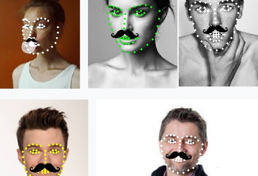

# Facial-Landmarks

Python. OpenCV. Dlib library.





### HOW TO USE

1. Download [http://dlib.net/files/shape_predictor_68_face_landmarks.dat.bz2](http://dlib.net/files/shape_predictor_68_face_landmarks.dat.bz2), unzip and put file `shape_predictor_68_face_landmarks.dat` to this directory

2. If this version of `dlib.pyd` file doesn't work on you computer, download [dlib](http://dlib.net/) and install it by running `python setup.py install`

3. Install OpenCV and other libraries. I recommend [Anaconda](https://www.anaconda.com/download/#download)

4. In `cmd` type: `python face.py CAPTURE_DEVICE RESIZE_LEVEL`

  `CAPTURE_DEVICE` 0, 1... or full path to file like `"D:\file.mp4"`

  `RESIZE_LEVEL` <= 1.0 lower resolution, more FPS. Because Python Dlib library is quite slow you can expect 5 FPS on Intel i5 for 640x480px video (25% CPU usage)

  ```
  example: python face.py 0 0.5
  example: python face.py video.mp4 0.25
  ```

5. Press keyboard key `1` to show facial landmarks as dots, `2` to show facial landmarks as numbers and `ENTER` to exit.
